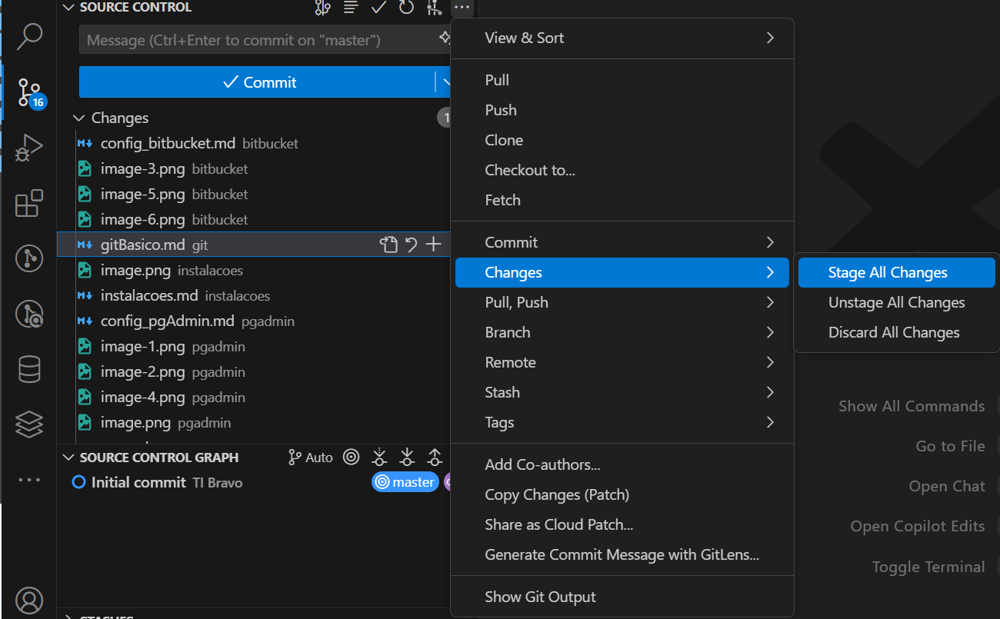
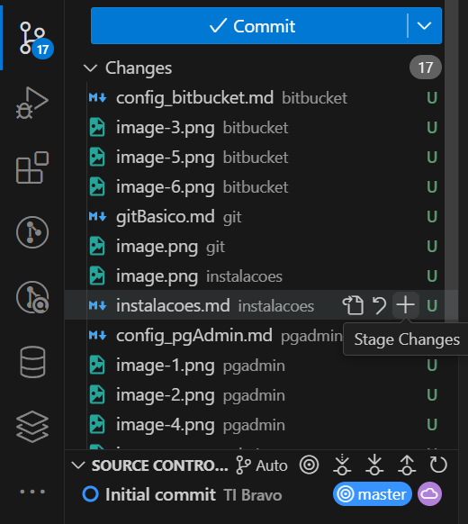
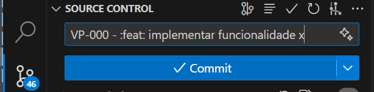

# O que é o Git?

O Git é um sistema de controle de versão distribuído, usado para rastrear alterações em arquivos e coordenar o trabalho entre várias pessoas em um projeto. Ele permite que desenvolvedores trabalhem simultaneamente, gerenciem versões do código e revertam mudanças se necessário.

-  **Controle Distribuído** – Cada desenvolvedor tem uma cópia completa do repositório.

- **Rastreamento de Alterações** – Registra todas as modificações feitas no projeto.

- 📁 Projeto no Commit 1

```less
📂 src/
  ├── main.py (hash: A1B2)
  ├── utils.py (hash: C3D4)
```

- 📁 Projeto no Commit 2 (apenas main.py mudou)

```less
📂 src/
  ├── main.py (hash: E5F6) ✅ Novo snapshot criado
  ├── utils.py (hash: C3D4) 🔄 Referência ao commit anterior
```

- **Branches e Merges** – Permite criar ramificações para novas funcionalidades e mesclá-las depois.

- Cenário Inicial - Linha do Tempo da Branch main
```
A -- B -- C   (main)

```
- Criando uma Nova Branch (feature)
```
A -- B -- C   (main)
         \
          D -- E  (feature)
```
- Merge da feature na main
```
A -- B -- C ------ F  (main)
         \       /
          D -- E  (feature)
```

- **Colaboração Eficiente** – Facilita o trabalho em equipe com plataformas como GitHub, GitLab e Bitbucket.

- **Rápido e Seguro** – Operações são realizadas localmente, garantindo desempenho ágil.


# Comandos Git

## Clone

```git clone``` - Clonar um repositório remoto para o diretório de trabalho local.

## Clonar um repositório específico:

```bash
git clone https://github.com/usuario/repositorio.git
```

## Add
```git add``` - Adicionar arquivos que estão no diretório de trabalho à área de teste (staging).

- Variações do git add
```
git add --all
git add -A
git add ./dir/*
git add .

```



## Adicionar uma arquivo expecífico:

```bash
git add nome_arquivo.txt
```




## Status

```git status``` - Lista todos os arquivos novos ou modificados que farão parte do commit


## Commit

```git commit``` - Adicionar todos os arquivos que estão na área de staging no repositório local.


**Padrões de Commit:** [Clique aqui](/manual/padroescommit).

## Fazer um commit com uma mensagem descritiva:

```bash
git commit -m "VP-000 - :tada: init - iniciando o projeto"
```



## Corrigir o último commit

```bash
git commit --amend
```
- Abrirá um editor de texto no terminal
	- Faça a edição da mensagem do commt
	- digite :q e enter

## Branch
Branches (ou ramos) no Git são uma forma de isolar o trabalho em diferentes linhas de desenvolvimento dentro de um repositório. Cada branch pode ser vista como uma linha de desenvolvimento separada, permitindo que você trabalhe em novas funcionalidades, correções de bugs ou experimentos sem afetar a branch principal (geralmente chamada de ```main``` ou ```master```).

**Comandos de manipulação de branchs:** [Clique aqui](/manual/gitbranch).

## Fetch
```git fetch``` - Obter arquivos do repositório remoto para o repositório local, mas não para o diretório de trabalho.

## Merge
```git merge``` - Obter os arquivos do repositório local para o diretório de trabalho.

## Pull
```git pull``` - Obter arquivos do repositório remoto diretamente no diretório de trabalho. É equivalente a um git fetch e um git merge.

- ``git pull``: Faz o merge das alterações remotas e locais, criando um commit de merge, se necessário.
- ``git pull --rebase``: Aplica suas alterações locais por cima das alterações remotas, evitando commits de merge e resultando em um histórico linear mais limpo.

## Push
```git push``` - Adicionar todos os arquivos confirmados no repositório local ao repositório remoto. Portanto, no repositório remoto, todos os arquivos e alterações estarão visíveis para qualquer pessoa com acesso ao repositório remoto.

## Stash
```git stash``` - Armazenar temporariamente as mudanças no diretório de trabalho que ainda não foram confirmadas para que você possa trabalhar em outra coisa e depois voltar a essas mudanças.

**Comandos de manipulação de Stash:** [Clique aqui](/manual/gitstash).

