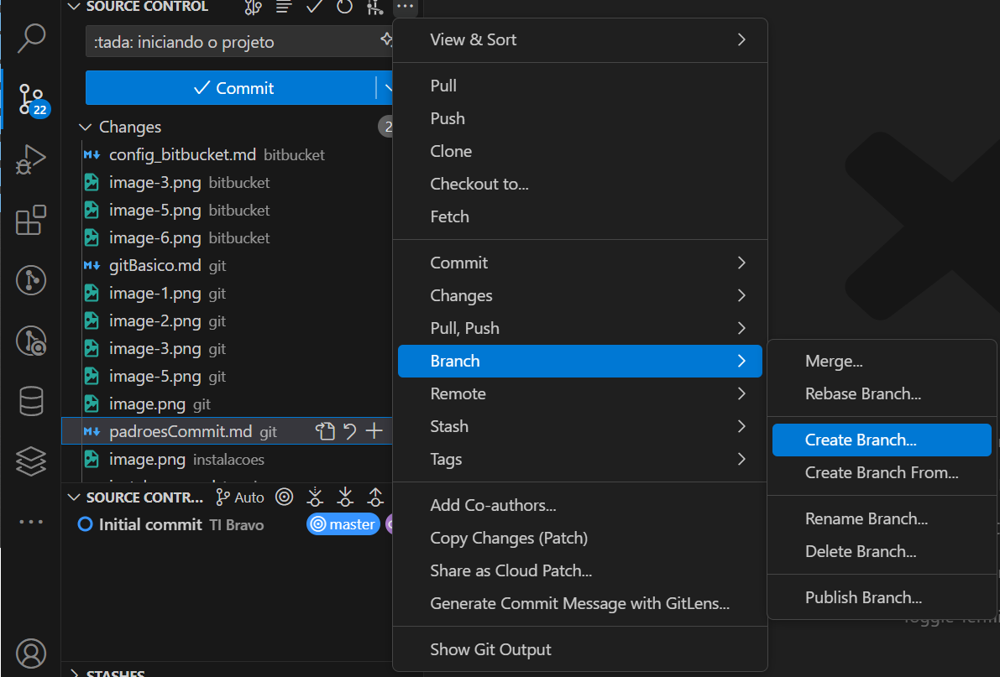

```git branch``` - Listar, criar ou excluir branches.

## Listar todas as branches existentes:

```bash
git branch
```

## Criar uma nova branch:

- Use o nome do jira como nome da branch

```bash
git branch nome_da_branch
```



## Mudar para uma branch existente

```bash
git checkout nome_da_branch
```
ou 

```bash
git switch nome_da_branch
```

## Renomear uma branch

```bash
git branch -m novo_nome
```

## Renomear uma branch específica

```bash
git branch -m nome_antigo novo_nome
```

## Excluir uma branch

```bash
git branch -d nome_da_branch
```
