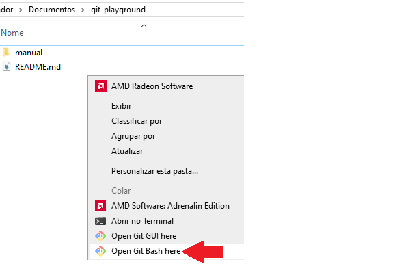

# 📌 Configuração de um Novo Usuário no Git

Antes de começar a versionar seus arquivos, é importante configurar o **nome** e o **e-mail** do usuário que o Git vai usar para registrar suas alterações.

# 🚩 Dentro do repositório
- Acesse o git bash



## ✅ 1. Configurar Nome do Usuário

```bash
git config --global user.name "username"
```

---

## ✅ 2. Configurar o E-mail do Usuário

```bash
git config --global user.email "seu_email@exemplo.com"
```

---

## ✅ 3. Verificar se as configurações foram aplicadas

```bash
git config --global --list
```

✔ Saída esperada:
```
user.name=username
user.email=seu_email@exemplo.com
```


