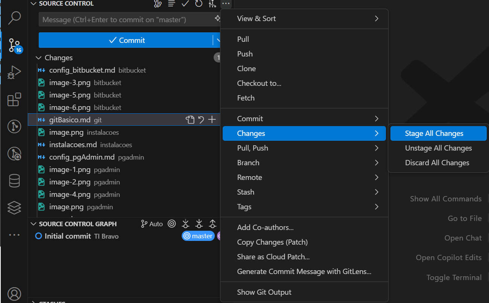

## Estou iniciando um novo projeto ou nova feature

## Passo 1: Verificar se há modificações no repositório remoto


- Usando o terminal

```bash
git fetch
```

- Se houver modificações, verificar os arquivos que foram modificados

```bash
git diff --name-only HEAD origin/master
```


- Usando o terminal

```bash
git pull --rebase
```

## Passo 2: Criar um novo branch para o novo projeto


- Dar nome à branch

> Use o nome do jira como nome da branch.
{.is-info}


- Usando o terminal

```bash
git checkout -b nome_da_branch
```

---

- Modificações feitas ✔

## Passo 3: Verificar o status do repositório local

```bash
git status
```
- Resultado esperado caso haja modificações:
```bash
Changes not staged for commit:
  (use "git add <file>..." to update what will be committed)
  (use "git restore <file>..." to discard changes in working directory)
        modified:   src/arquivo_modificado.py
        modified:   src/arquivo_modificado2.py

Untracked files:
  (use "git add <file>..." to include in what will be committed)
        src/arquivo_novo.py
        src/arquivo_novo2.py
```

## Passo 4: Adicionar as modificações ao stage

- Adicionar um arquivo específico e realizar o commit com a mensagem específica para o arquivo
    - Adicionar arquivos individualmente é excelente para granularidade e para tornar os commits mais descritivos.


```bash
git add arquivo_modificado.py
```

- Adicionar todos os arquivos modificados
    - Realizar o commit com uma mensagem geral


- Usando o terminal

```bash
git add .
```

## Passo 5: Fazer o commit


- Use o padrão de commit [Clique Aqui](/visoes/manual/padroescommit).


- Usando o terminal

```bash
git commit -m "VP-000 - :feat: implementar funcionalidade x"
```

```bash
git commit -m "VP-000 - :fix: corrigir bug na funcionalidade y"
```

## Passo 6: Enviar branch para o repositório remoto

- Aplicar o push pelo vscode
  - Adicionar a mensagem do push
  - Clicar em publicar


- Usando o terminal

```bash
git push origin nome_da_branch -m "Mensagem do push"
```

## Passo 7: Realizar o merge da branch com a master

- Voltar para a branch master
  - Clicar na branch atual abaixo


- Selecionar a branch master


- Realizar o pull


- Buscar a função de merge


- Escolha a branch que deseja fazer o merge


- Usando o terminal

```bash
git checkout master
```
```bash
git pull
```
```bash
git merge nome_da_branch
```

## Passo 8: Enviar as modificações para o repositório remoto

- Adicionar modificações ao stage



- Aplicar o push pelo vscode
  - Adicionar a mensagem do push
  - Clicar em publicar


- Usando o terminal

```bash
git status
```

```bash
git add .
```

- Use o nome do jira como nome da branch.

```bash
git commit -m "VP-000 - :feat: implementar funcionalidade x"
```

```bash
git push origin master
```

## Passo 9: Realizar o pull no servidor

- Acessar o servidor
  - Realizar o pull


- Usando o terminal

```bash
git pull
```


