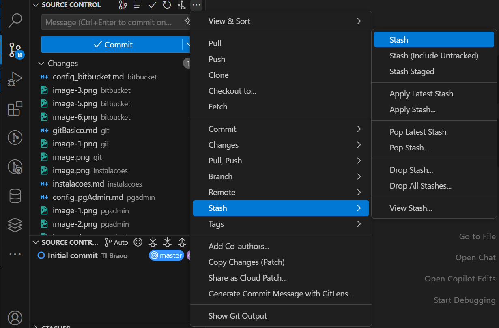
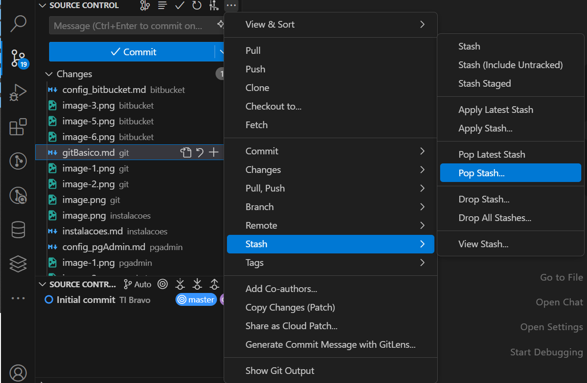
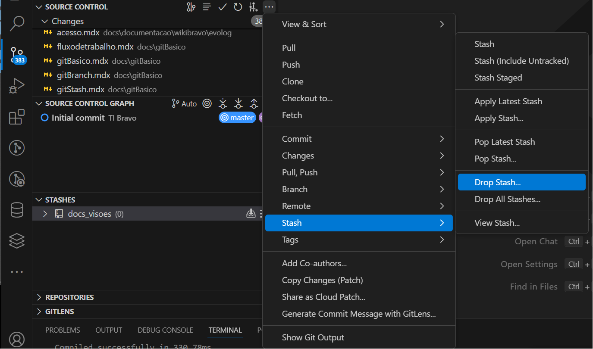

## Armazenar as mudanças em Stach:

```bash
git stash
```

## Listar todas as mudanças armazenadas:

```bash
git stash list
```



## Recuperar o stash mais recente:

```bash
git stash pop
```




## Recuperar um stash específico sem removê-lo da lista:
```bash
git stash apply stash@{0}
```

## Remover um stash específico:
```bash
git stash drop stash@{0}
```



